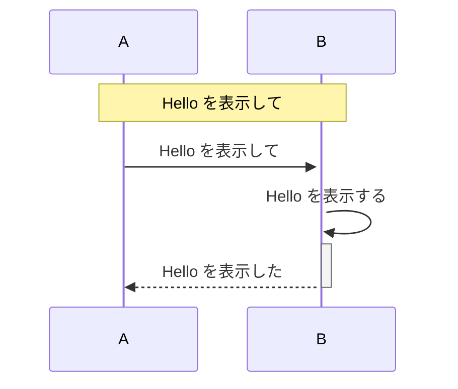

私事であるが、[Visual Studio Code](https://code.visualstudio.com/) をメインエディタとして使用している。
で、資料を作る際にシーケンス図をパパッと書きたい、といったときに便利なツールとして [mermaid.js](https://mermaidjs.github.io/) があるということを知ったので、私なりの導入や利用方法について備忘録がてら記事にしたい。


## 前提

* シーケンス図を描きたいが UML モデリングツールを使うのは面倒だ
* Visual Studio Code を使用している
* Visual Studio Code からシーケンス図が書けたら幸せだなぁという願望がある
* そしてそのシーケンス図をHTMLドキュメントに出力できたら嬉しい

で、本記事の趣旨は **Markdown でシーケンス図を書こう**｡ そしてそれを **HTMLドキュメントに出力しよう** ということなので、そのためのアレコレを以下に記していく。


## mermaid.js を使おう

冒頭で触れた mermaid.js を使うと次の資料を作成できる。

* [フローチャート](https://mermaidjs.github.io/flowchart.html)
* [シーケンス](https://mermaidjs.github.io/sequenceDiagram.html)
* [ガントチャート](https://mermaidjs.github.io/gantt.html)

mermaid.js の記法については上記リンクに書き方が載っているので参照されたい。


## Markdown Preview Enhanced を入れよう

Visulal Studio Code の 拡張機能( Extention ) に [Markdown Preview Enhanced](https://shd101wyy.github.io/markdown-preview-enhanced/#/) というものがある。
この拡張機能は

* [mermaid.js の記法に対応](https://shd101wyy.github.io/markdown-preview-enhanced/#/diagrams?id=mermaid) してくれている
* [HTML への Export に対応](https://shd101wyy.github.io/markdown-preview-enhanced/#/html?id=html-export) してくれている

ので非常に便利なので、これを使う。

なおインストールは Visual Studio Code の拡張機能のインストールから行う。
[本家のコチラ](https://shd101wyy.github.io/markdown-preview-enhanced/#/vscode-installation) にインストール方法があるのでご参考まで。


## 実際にシーケンス図を描いてみよう

次のシーケンスを図に起こしてみる。

* A から B に「Hello」という文字列を表示してというリクエストを出す
* B はリクエストを受けて「Hello」いう文字列を表示したのち、レスポンスを A に返す

単純なリクエストとレスポンスだが、上記では3つのアクションが発生する。
それを mermaid.js で表現すると次のようになる｡


* 画像ではなく実際に Markdown で記述した場合は下記となる
* ブロックを示す ｢ ```mermaid ｣ の部分が Markdown の解釈で表示されなくなってしまっているが､もしお試しいただく際は下記をご利用いただければ｡｡｡



## Markdown Preview Enhanced で見てみよう

作成したシーケンスは前掲の Markdown Preview Enhanced でプレビューから見ることができる。

1. 「右クリック」 -> 「Markdown Preview Enhanced: Open Preview [Ctrl+K V]」を選択する

1. これでエディタが縦に分割されプレビューが表示される

 * 左側は Markdown ファイル
 * 右側がプレビュー
 * 左側の水色枠で囲った mermaid で記述したシーケンスが図面化したものがプレビューのオレンジ枠で囲った部分
 * しっかりと図面化されていることが確認できる


## HTML に出力しよう

そして表示したプレビューは HTML ファイルに出力することができる。
これによって､シーケンス図込みで作成した Markdown を HTMLドキュメントとして他者と共有することができるので非常に嬉しい｡

方法は次の通り｡

1. 「右クリック」->「HTML」-> 「HTML(offline)」を選択する

1. これで HTML が出力された

 * オレンジ枠で囲った部分は HTML 出力が行われたことを示すメッセージ
 * なお出力先は編集中の Markdown ファイルと同じ PATH となる

さて、ここでひとつ注意点がある。
出力された HTML をエディタでみると、head タグは

```html:出力されたHTMLのヘッダ(抜粋かつ余計な改行は削除してある)
      <link rel="stylesheet" href="file:///C:\Users\hogehoge\.vscode\extensions\shd101wyy.markdown-preview-enhanced-0.3.5\node_modules\@shd101wyy\mume\dependencies\katex\katex.min.css">
      <link rel="stylesheet" href="file:///C:\Users\hogehoge\.vscode\extensions\shd101wyy.markdown-preview-enhanced-0.3.5\node_modules\@shd101wyy\mume\dependencies\mermaid\mermaid.css">

      <script type="text/javascript" src="file:///C:\Users\hogehoge\.vscode\extensions\shd101wyy.markdown-preview-enhanced-0.3.5\node_modules\@shd101wyy\mume\dependencies\mermaid\mermaid.min.js"></script>
```

となっていて、link タグや script タグを見ると css や js が Visual Studio Code の extensions の下を指している。
これでは他者にこの HTML を渡した際に正常に表示されない。

これの対処には [cdnjs-mermaid](https://cdnjs.com/libraries/mermaid) を使うと便利だ。
上記リンクから ｢```https://cdnjs.cloudflare.com/ajax/libs/mermaid/7.1.2/mermaid.min.js```｣ をコピー｡


で、前掲の部分を書き換えると次のようになる。

```html:出力されたHTMLのヘッダ(抜粋かつ余計な改行は削除してある)
      <script type="text/javascript" src="https://cdnjs.cloudflare.com/ajax/libs/mermaid/7.1.2/mermaid.min.js"></script>
```

link タグは cdnjs で対応するものが見つからなかったので 2つとも削除しているが、私の環境では link タグについては記述がなくとも cdnjs の適用前後で同じ表示となったのでこれで良しとしたい。


## 終わりに

以上､手前味噌ながら mermaid.js によるシーケンス図の作成とその Markdown の HTML ドキュメントへの出力についての記事となる｡

紹介した Markdown Preview Enhanced をインストールしていただき､本記事の Markdown を使ってプレビューを見ると､ [実際にシーケンス図を描いてみよう](#実際にシーケンス図を描いてみよう) で載せた mermaid の部分がシーケンス図になることを確認できる｡
ご興味あればお試しいただくのも面白いかと｡


## 参考

* [mermaid.js](https://mermaidjs.github.io/)
* [mermaid.jsが素晴らしいけどなかなか使ってる人見かけないので実例晒す(追記あり)](https://qiita.com/uzuki_aoba/items/a01f8b0b52ced69c8092)
* [VScodeでmermaidを使ったmarkdown資料作りメモ](https://qiita.com/mumumushi/items/693ee8fd93146dd69b0e)
* [cdnjs(GitHub)](https://github.com/cdnjs/cdnjs)
* [cdnjs(Service)](https://cdnjs.com/)
